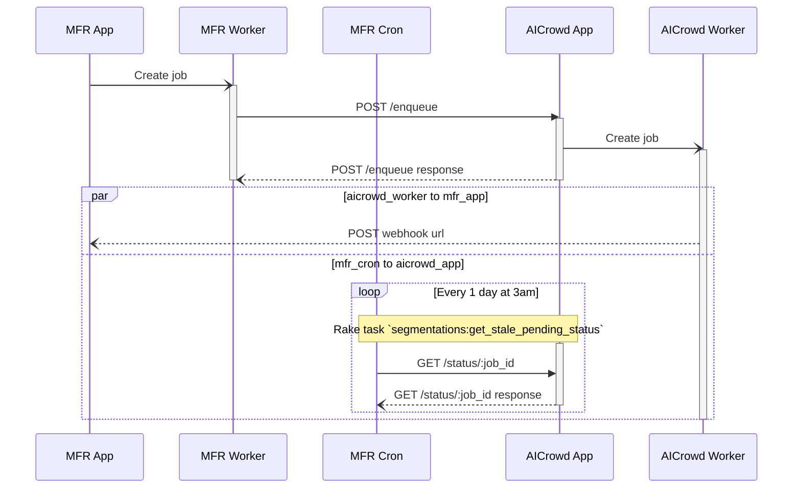
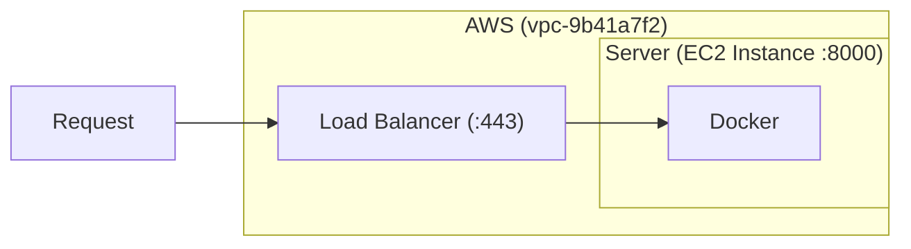

# AICrowd Food API

## Schemas

### Sequence diagram for the interaction between MyFoodRepo and AICrowd Food API

### AICrowd Food API architecture

## Server

### Info

The server is an EC2 instance on AWS.

* Instance type: `g4dn.xlarge`
* Instance zone: `eu-central` (Frankfurt)
* Instance name: `AICrowd Food API`
* AWS VPC: `vpc-9b41a7f2`
* Elastic IP linked to the instance: `18.158.148.138`
* Public DNS: `ec2-18-158-148-138.eu-central-1.compute.amazonaws.com`
* The API server runs on the port `8000`
* Open ports:
  * 22: For SSH connections, accessible worldwide
  * 8000: For the app, accessible only by the `sg-86c627ef` security group (the group used by the load balancer)

### How to connect

You can find the ssh key on 1Password under the name `AICrowd Food API EC2 SSH Key`.

Then, run the following command: `ssh -i ~/.ssh/aicrowd_food_api_key.pem ubuntu@18.158.148.138`

## Load balancer

* AWS Name: `aicrowd-food-api-load-balancer`
* AWS Target group: `aicrowd-food-api-target-group`
* AWS VPC: `vpc-9b41a7f2`
* DNS name: `aicrowd-food-api-lb-636477160.eu-central-1.elb.amazonaws.com`
* DNS CNAME: `aicrowd-api.myfoodrepo.org` – DNS server for myfoodrepo.org is on [NameCheap](www.namecheap.com)
* Open port: 443 (HTTPS/SSL)
* The SSL certificate is created and managed by the AWS Certificate Manager

### Resources

* https://docs.aws.amazon.com/elasticloadbalancing/latest/application/create-https-listener.html

## Code repository

The main code repository for the AICrowd Food API is hosted on a [gitlab.aicrowd.com](https://gitlab.aicrowd.com/food-recognition-challenge/food-recognition-api-v1).

We also have a backup of this repository on our [GitHub account](https://github.com/digitalepidemiologylab/aicrowd-food-api).

## ML models backup

On the main [repository](#code-repository), [Git LFS](https://git-lfs.github.com) is used to store the ML models. Due to GitHub limit to max 4Go files, we can't do the same on our GitHub repository backup. So we use S3 to backup ML models:

* Bucket: `myfoodrepo-backup`
* Folder: `aicrowd-ml-models`
* Storage class: `Glacier Flexible Retrieval` (formerly Glacier)
