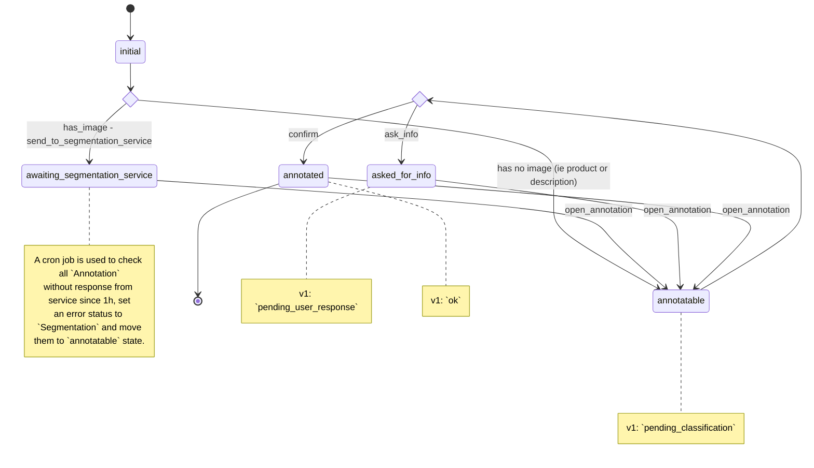

# Annotation statuses

## State diagram

```mermaid
stateDiagram-v2
  state if_info_needed_state <<choice>>
  state has_image <<choice>>

  [*] --> initial

  initial --> has_image
  has_image --> awaiting_segmentation_service : has_image - send_to_segmentation_service
  has_image --> annotatable : has no image (ie product or description)

  awaiting_segmentation_service --> annotatable : open_annotation

  annotatable --> if_info_needed_state
  if_info_needed_state --> annotated : confirm
  if_info_needed_state --> asked_for_info : ask_info

  asked_for_info --> annotatable: open_annotation

  annotated --> annotatable : open_annotation

  annotated --> [*]

  note right of awaiting_segmentation_service
    A cron job is used to check all `Annotation`
    without response from service since 1h, set
    an error status to `Segmentation` and move
    them to `annotatable` state.
  end note
  note right of annotatable
    v1: `pending_classification`
  end note
  note right of asked_for_info
    v1: `pending_user_response`
  end note
  note right of annotated
    v1: `ok`
  end note
```
