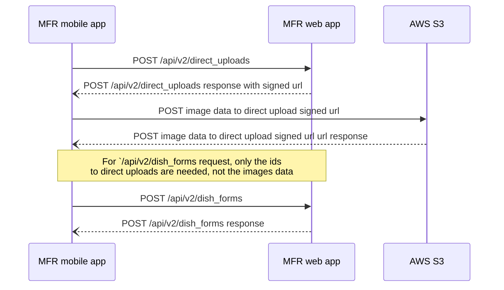

# Direct upload

## Schema

```mermaid
sequenceDiagram
  participant mfr_mobile_app as MFR mobile app
  participant mfr_web_app as MFR web app
  participant aws_s3 as AWS S3
  mfr_mobile_app ->> mfr_web_app : POST /api/v2/direct_uploads
  mfr_web_app --) mfr_mobile_app : POST /api/v2/direct_uploads response with signed url
  mfr_mobile_app ->> aws_s3 : POST image data to direct upload signed url
  aws_s3 --) mfr_mobile_app : POST image data to direct upload signed url url response
  Note over mfr_mobile_app,mfr_web_app : For `/api/v2/dish_forms request, only the ids<br> to direct uploads are needed, not the images data
  mfr_mobile_app ->> mfr_web_app : POST /api/v2/dish_forms
  mfr_web_app --) mfr_mobile_app : POST /api/v2/dish_forms response
```
