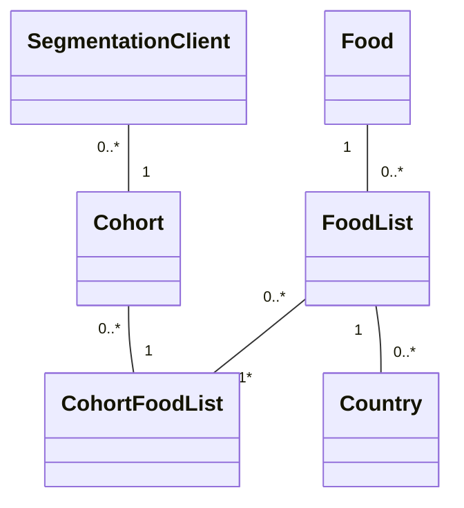
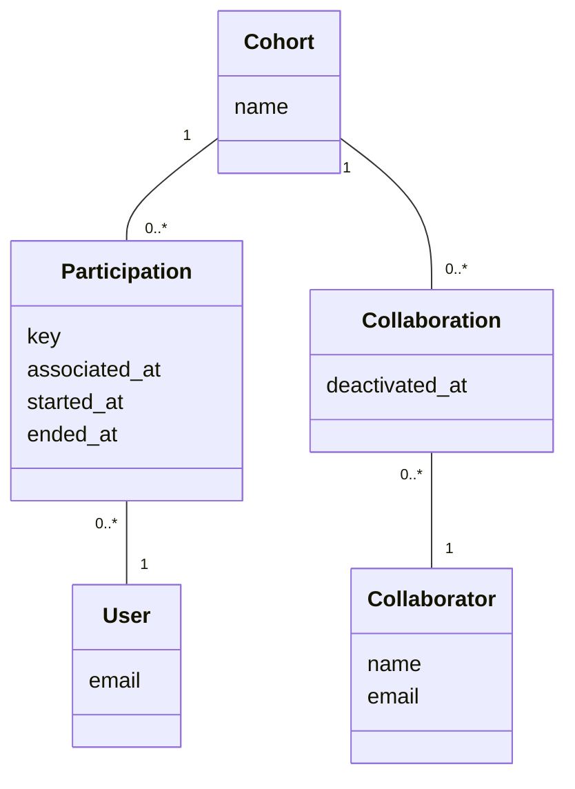
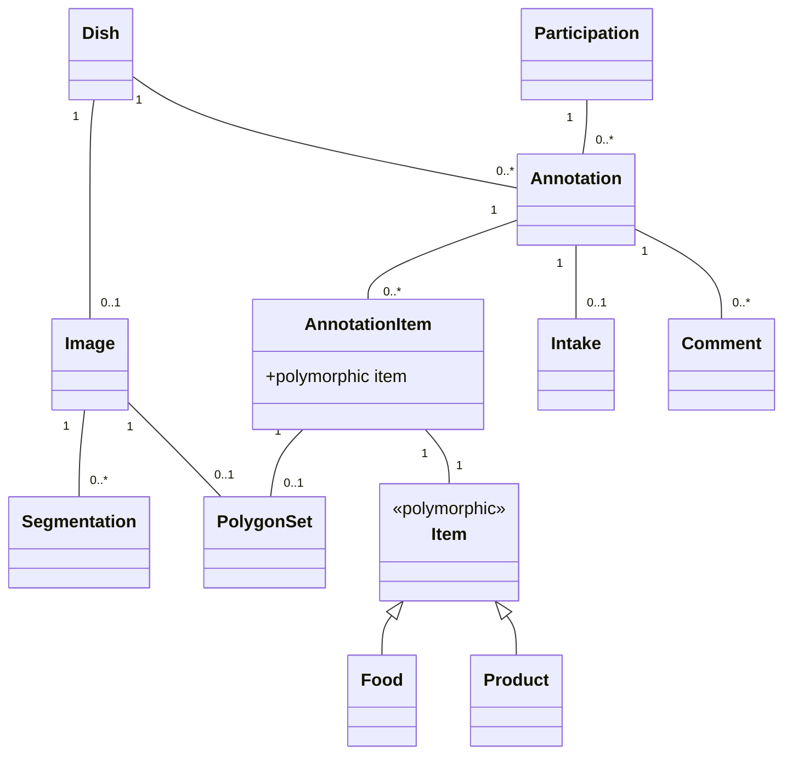

# Domain models

## Cohort

A cohort groups users who want to keep track of their food consumption. It is identified by a unique name and is managed by collaborators.
It is associated with `FoodList`s, such that any dish in this cohort must be annotated using only those FoodLists' foods.
A `Cohort` is also associated with a `SegmentationModel` that will determine how `DishImage` of this cohort will be segmented.

## User

The user is a person who wants to keep track of his/her food consumption through the mobile app. A user can be participate to only one cohort at a time, through a `Participation` object. It can be anonymous or identified by an email address.

## Participation

A `Participation` makes the link between a `User` and a `Cohort`. Typically a cohort manager (`Collaborator`) creates a participation for that cohort and share the key of that participation with the user. The user can then use that key to join the cohort by entering it in the mobile app. When done, this sets the `associated_at` datetime attribute of the `Participation` object. When creating a participation, the `started_at` and `ended_at` datetime attributes can be set to specify the duration of the participation. If the `ended_at` datetime attribute is set and is in the past, the user can no longer upload pictures to the cohort.

## Collaborator

The collaborator is a person who manages cohorts of users through the web app. There is three types of collaborators:

- `Admin`: A super collaborator who can manage all cohorts and other collaborators
- `Manager`: A collaborator who can manage a subset of cohorts
- `Annotator`: A collaborator who is in charge of annotating the pictures taken by the users in a subset of cohorts

A collaborator can be associated to multiple cohorts through a `Collaboration` object. It is identified by a name and email address.

## Collaboration

A collaboration makes the link between a `Collaborator` and a `Cohort`. A collaboration starts on the `started_at` datetime and ends on the `ended_at` datetime attribute.

## Dish

When logged in the mobile app, a user can take capture its meal consumption by either taking a picture of a dish, by scanning a product barcode or by entering the text description of the dish. When doing this, the mobile app sends the information to the web backend through the API.
The web backend then creates a `Dish` object associated with the `User` who took the picture. When created, the `Dish` is also immediately associated with an `Annotation`, itself associated with an `Intake` which captures the time and "location" (timezone) of the dish consumption. Other intakes of the same dish can then be captured later on, for example through the "Quick pick" feature of the mobile app.

## Segmentation

When the dish is created with a picture, it is also associated with a `Segmentation` object. The segmentation sends the picture to an automated segmentation service that returns a collection of `PolygonSet` objects containing the location of a specific food in the dish picture. When receiving this data, the segmentation object creates the corresponding `AnnotationItem` objects.

For more information about the segmentation service, see the [AIcrowd segmentation service documentation](/doc/aicrowd_food_api.md).

For more information about the segmentation lifecycle, see the [Segmentation statuses documentation](/doc/segmentation_statuses.md).

## Annotation

The annotation is a very important object in the system as it makes the link between the dish, its intakes, a cohort, and the food or products that are present in the dish.
It is associated with multiple `AnnotationItem` objects that captures which foods or barcoded products are present in the dish. Annotation items are created by an automated segmentation service or my a human annotator (collaborator).
The annotation is also linked with a user and a cohort through a `Participation`. This means that the same dish can be annotated multiple times in different cohorts.
It can also be associated with mutiple `Comment` objects. The comments are used to dialog with the user and ask him/her information about the dish.

### Lifecycle

An typical annotation goes through the following lifecycle: `initial` -> `awaiting_segmentation_service` -> `annotatable` -> `info_asked` -> `annotated`.

- `initial`: The state of a newly created annotation, before the segmentation service has been called.
- `awaiting_segmentation_service`: The state of an annotation after the segmentation service has been called. The segmentation service is an external service that takes a dish picture and returns a list of `PolygonSet` objects that capture the location of the food in the dish picture. The segmentation service is called asynchronously, so the annotation is in this state until the segmentation service has finished.
- `annotatable`: The state of an annotation after the segmentation service has finished. The annotation is now ready to be annotated by a human annotator.
- `info_asked`: The state of an annotation after the human annotator has asked the user for more information about the dish. The user can then answer the question by adding a comment to the annotation.
- `annotated`: The state of an annotation after the human annotator has finished annotating the dish.

For more information about the annotation lifecycle, see the [Annotation statuses documentation](/doc/annotation_statuses.md).

Once the annotation is in the `annotated` state, update and commenting are disabled. To re-enable them, the annotation must be reset to the `annotatable` state by clicking on the "Allow annotation" button in the annotation page.

## AnnotationItem

The annotation item is an object that makes the link between a dish and a food or product. It is associated with a `PolygonSet` object that captures the location of the food or product in the dish picture. It is also associated with a `Item` object that captures the food or product information.

## FoodList

A `FoodList` groups `Food` from the same source and version. It can be `#editable` or not. Typically a `FoodList` imported from an official source is not editable, while a custom `FoodList` created for a specific cohort is editable.

## Food

A `Food` is associated to a specific `FoodList` and is editable depending on the `FoodList` it belongs to.

## Product

MyFoodRepo caches product data in its own database. Product data comes from [FoodRepo](https://foodrepo.org/). When a user scans a product barcode and the product does not already exist in the MyFoodRepo database, the user will be asked to take at least five pictures of the product that are recorded together with the the barcode in the database. MyFoodRepo backend will then check on FoodRepo if data already exists for this product. If it does, the data is imported in the MyFoodRepo database. If it does not, the product pictures will be uploaded to FoodRepo for parsing. MyFoodRepo backend will the periodically ask for updated product. For more information about the product lifecycle, see the [documentation about sync between FoodRepo and MyFoodRepo](/doc/foodrepo_sync.md).
