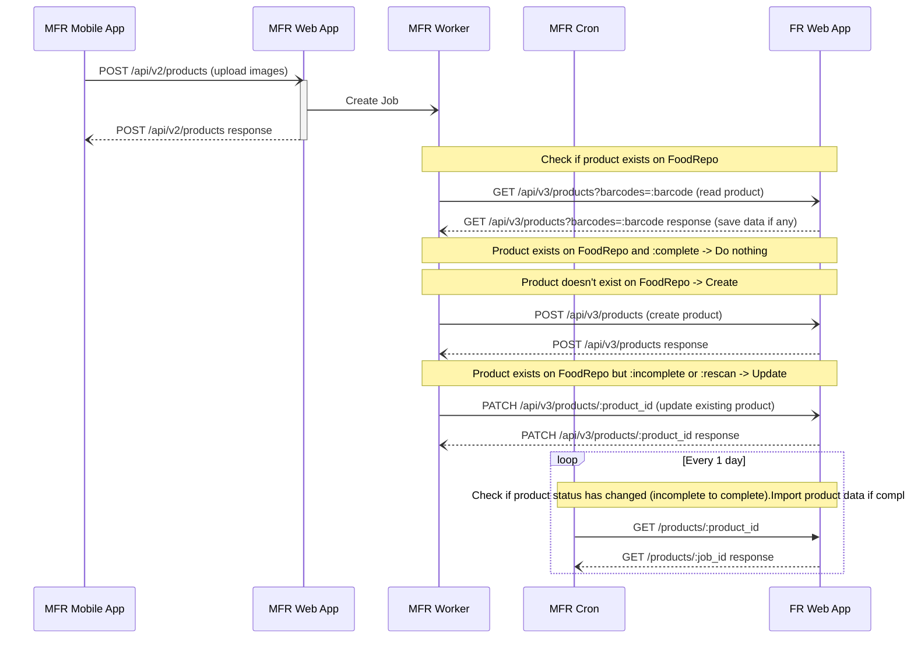
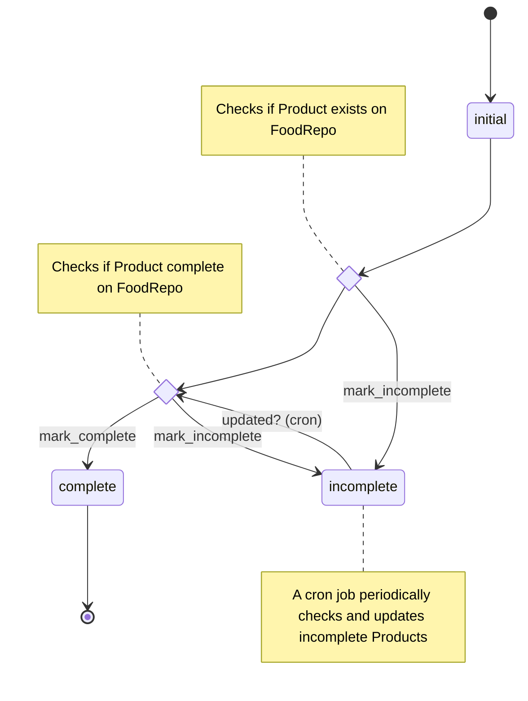

# Sync product between FoodRepo and MyFoodRepo

## Sequence diagram

```mermaid
sequenceDiagram
  participant mfr_mobile as MFR Mobile App
  participant mfr_web as MFR Web App
  participant mfr_worker as MFR Worker
  participant mfr_cron as MFR Cron
  participant fr_web as FR Web App

  mfr_mobile -) mfr_web : POST /api/v2/products (upload images)
  activate mfr_web
  mfr_web -) mfr_worker : Create Job
  mfr_web --) mfr_mobile : POST /api/v2/products response
  deactivate mfr_web
  Note over mfr_worker,fr_web : Check if product exists on FoodRepo
  mfr_worker -) fr_web : GET /api/v3/products?barcodes=:barcode (read product)
  fr_web --) mfr_worker : GET /api/v3/products?barcodes=:barcode response (save data if any)
  Note over mfr_worker,fr_web : Product exists on FoodRepo and :complete -> Do nothing
  Note over mfr_worker,fr_web : Product doesn't exist on FoodRepo -> Create
  mfr_worker -) fr_web : POST /api/v3/products (create product)
  fr_web --) mfr_worker : POST /api/v3/products response
  Note over mfr_worker,fr_web : Product exists on FoodRepo but :incomplete or :rescan -> Update
  mfr_worker -) fr_web : PATCH /api/v3/products/:product_id (update existing product)
  fr_web --) mfr_worker : PATCH /api/v3/products/:product_id response
  loop Every 1 day
    Note over mfr_cron,fr_web : Check if product status has changed (incomplete to complete).Import product data if complete.
    mfr_cron ->> fr_web : GET /products/:product_id
    fr_web --) mfr_cron : GET /products/:job_id response
  end
```

## Product statuses

```mermaid
stateDiagram-v2
  state product_exist <<choice>>
  state product_complete <<choice>>

  [*] --> initial

  initial --> product_exist
  product_exist --> product_complete
  product_exist --> incomplete : mark_incomplete
  product_complete --> complete : mark_complete
  product_complete --> incomplete : mark_incomplete
  incomplete --> product_complete : updated? (cron)

  complete --> [*]

  note left of product_exist
    Checks if Product exists on FoodRepo
  end note
  note left of product_complete
    Checks if Product complete on FoodRepo
  end note
  note right of incomplete
    A cron job periodically checks and updates incomplete Products
  end note
```
