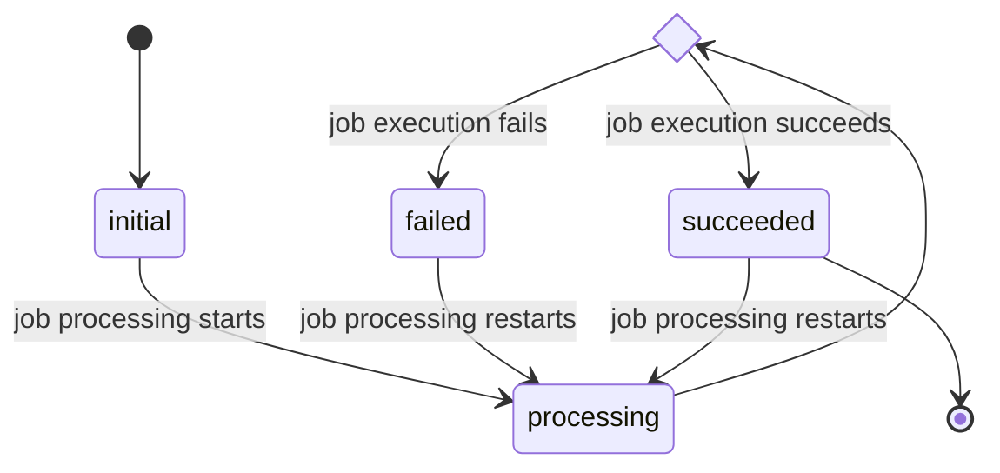

# Job log statuses

## State diagram

```mermaid
stateDiagram-v2
  state succeed <<choice>>

  [*] --> initial
  succeeded --> [*]

  initial --> processing : job processing starts
  processing --> succeed
  succeed --> failed : job execution fails
  succeed --> succeeded : job execution succeeds
  failed --> processing : job processing restarts
  succeeded --> processing : job processing restarts
```
