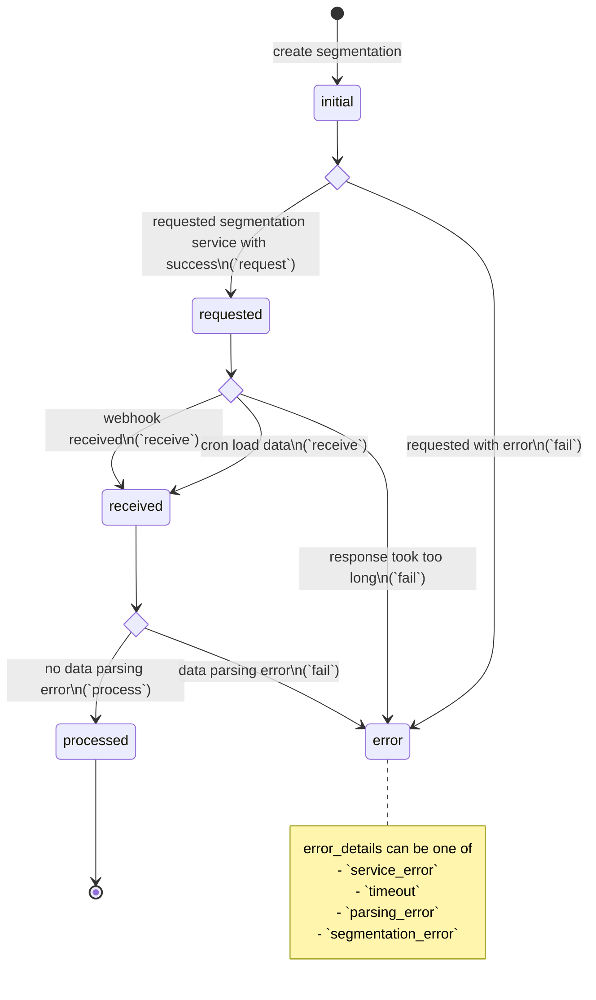

# Segmentation statuses

## Possible `status` values

* `initial`: request to segmentation service not sent yet
* `requested`: request to segmentation service sent
* `received`: response form segmentation received but not parsed yet
* `processed`: response form segmentation received processed
* `error`: error while requesting service, timeout (webhook not received) or error during response parsing

## State diagram

